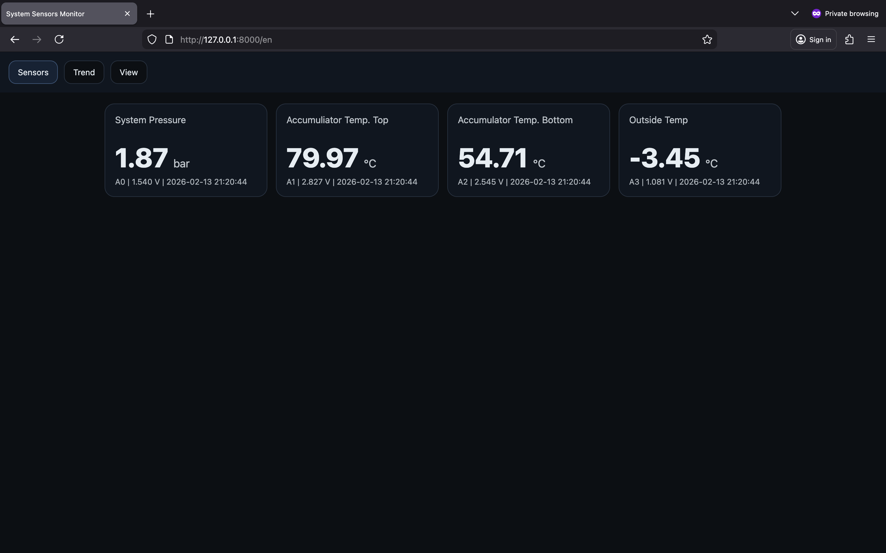
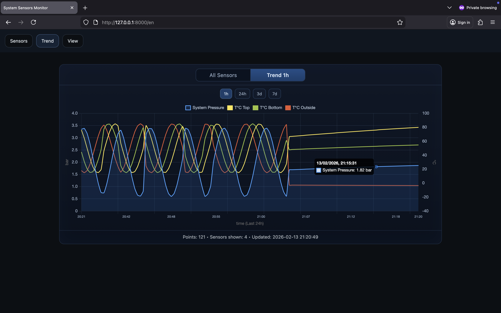
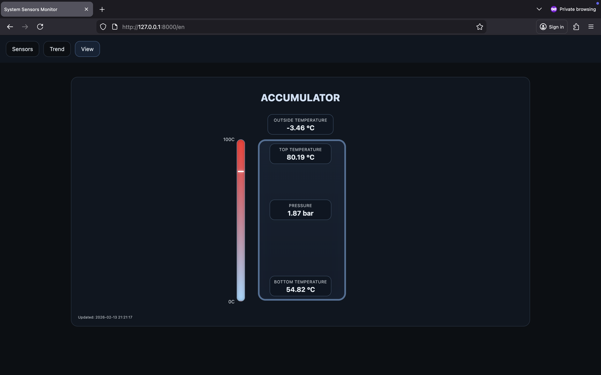
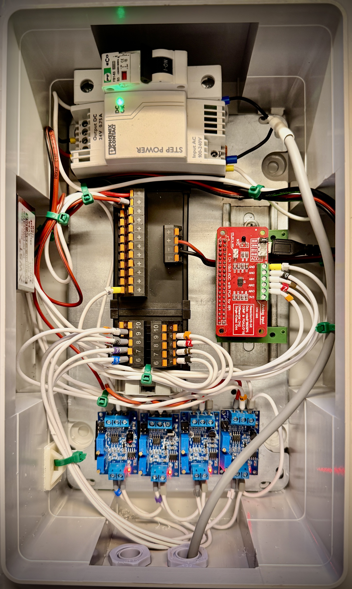

# Raspberry Home Live Monitoring
🏠 Live pressure and temperature monitoring system for a wood boiler accumulator.


### 🔌 Hardware
1. Raspberry Pi Zero 2 WHC 
2. Temperature Transmitter PT100 (4-20mA)
3. Pressure Transducer (4-20mA)
4. Current-to-voltage converter 4-20mA to 0-3.3V
5. ADS1115 A0..A3

## ⚙️ Install
```bash
sudo apt update
sudo apt install -y python3-pip python3-venv
mkdir -p ~/pressure_web && cd ~/pressure_web
python3 -m venv .venv
source .venv/bin/activate
pip install fastapi uvicorn adafruit-circuitpython-ads1x15
```

## ▶️ Run
```bash
source .venv/bin/activate
uvicorn app:app --host 0.0.0.0 --port 8000
```

## 🌐 Routes
1. English UI: `/en`
2. Russian UI: `/ru`
3. Default route `/` redirects to English (`/en`)

## 🧩 Sensor Config
Edit `config.py`:
1. Enable/disable: `PRESSURE`, `T1`, `T2`, `T3`
2. Channel mapping: `PRESSURE_CHANNEL`, `T1_CHANNEL`, `T2_CHANNEL`, `T3_CHANNEL` (A0..A3)
3. Display names:
   `System Pressure`, `Accumuliator Temp. Top`, `Accumulator Temp. Bottom`, `Outside Temp`
4. Engineering ranges: `*_MIN`, `*_MAX`

Disabled sensors are hidden from cards and graph automatically.

## 🔧 Systemd (Optional)
```bash
sudo nano /etc/systemd/system/pressure-web.service
sudo systemctl daemon-reload
sudo systemctl enable --now pressure-web
sudo systemctl status pressure-web
```

## 📝 OS Reminder
1. For Raspberry Pi board (Pi 3/4/5): install `Raspberry Pi OS Lite (64-bit)` (Bookworm).
2. For microcontroller (example: Raspberry Pi Pico): do not install Raspberry Pi OS. Flash microcontroller firmware (MicroPython/CircuitPython) instead.


## 🛠️ Useful Commands
```bash
lsof -nP -iTCP:8000 -sTCP:LISTEN 
uvicorn app:app --host 127.0.0.1 --port 8000
```

## 📸 Example Screens
### Tab 1


### Tab 2


### Tab 3


### Tab 4 Hardware without sensors

